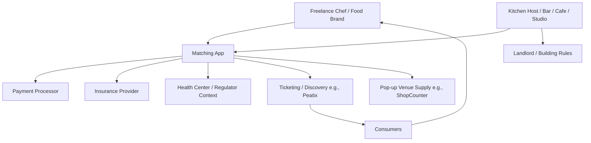

# Tokyo Market Deep Research: Freelance Chefs × Open/Shared Kitchens  
*Assessing the opportunity for an app that matches freelance chefs with available kitchens (Tokyo, Japan). Current date: 2026-02-23 (Asia/Tokyo).*

## Executive summary

Tokyo has a very large food-service base (76,127 establishments and 735,786 employees in “Accommodation and food services” in the latest Economic Census activity survey for Tokyo) and a rapidly diversifying set of “kitchen access” options: hourly rental kitchens, licensed restaurant spaces offered for sublet/day-part use, and multi-tenant cloud/ghost kitchen facilities. citeturn10view0 This creates a structurally attractive but compliance-heavy matching problem: chefs want compliant kitchens with the right permits/equipment at the right time; kitchen owners and venues want trust, risk controls (damage + product liability), and predictable utilization.

A key finding is that the *discoverable supply* of kitchen-equipped spaces in Tokyo is already large on general marketplaces (e.g., Space Market shows **1,050** “rental kitchen” listings in Tokyo), but only a subset is clearly positioned as “commercially licensed” or “commercially usable.” On Space Market’s Tokyo rental-kitchen page, “restaurant business permit included” listings are **519**, and “confectionery manufacturing permit” listings are **100**—a strong indicator that compliant inventory exists but is fragmented across platforms and tags. citeturn19view0turn20view1 Meanwhile, specialized “share restaurant / bar-daypart” supply is also large: ShareRestaurant (run under Yoshinoya HD branding) displays **1,292** shareable stores and **1,143** historical opening achievements (platform-wide), with many Tokyo listings priced in the tens of thousands to low hundreds of thousands JPY per month depending on schedule/area. citeturn23view0

On the “chef supply” side, Japan already has scaled chef networks: SHAREDINE positions itself as “Japan’s largest private chef service,” citing **30,000+ registered chefs** and entry pricing of **¥8,800 for 3 hours** (tax and travel included). citeturn39view0 For restaurant staffing, Spot Chef / CHEFLINK pricing disclosures (through an IT product pricing page) indicate a chef pay unit of **¥1,815/hour** plus a **16%–34.5%** service fee (depending on payment method), implying an all-in hourly cost example of **~¥2,440/hour** in a sample case. citeturn45view0 These benchmarks matter because they anchor what “chef time” costs and reveal that “chef marketplaces” exist—yet they typically do **not** solve the **kitchen-access** problem (especially compliance-grade kitchens for pop-ups, production, or brand testing).

Regulation is the major gating factor and also the product moat: Japan’s HACCP-aligned hygiene management is effectively mandatory for food businesses from **June 1, 2021**, and Tokyo’s “Food Sanitation Window” makes clear that permits/notifications and hygiene plans are reviewed/required depending on activity (with online filing available via the national food-sanitation application system). citeturn44view0turn26view0 The winning app in Tokyo is likely the one that treats licensing/roles/insurance as first-class objects (not “notes”), and that can reliably answer: “Can I legally make/sell *this product* from *this kitchen* on *this date* with *this operator structure*?”

A realistic, assumption-driven market sizing for *hourly kitchen rentals used by independent chefs/brands in Tokyo* yields a wide but meaningful GMV range: roughly **~¥0.9B to ~¥21.6B annually**, with a “base” scenario near **~¥4.8B**. (Transparency: this is a modeled range; underlying assumptions are stated in the market sizing section.) The near-term SOM is practical if the app can win a few hundred to a couple thousand repeat chefs and a curated set of compliant kitchens, because repeat utilization drives marketplace density faster than “one-off event rentals.”

## Ecosystem overview in Tokyo

Tokyo’s “open/shared kitchen” ecosystem is best understood as five overlapping supply types that serve different chef jobs-to-be-done.

**Kitchen-equipped rental spaces (general marketplaces, often event-first).** Space Market’s Tokyo rental-kitchen page shows **1,050** listings, spanning everything from party kitchens to studio kitchens to restaurant-like spaces. citeturn19view0 Within that, Space Market’s filter-style counts suggest **519** listings tagged as having a restaurant business permit and **100** tagged with a confectionery manufacturing permit—useful signals that there is a non-trivial “licensed-capable” subset. citeturn20view0turn20view1

**Commercial kitchen studios (repeatable, managed inventory).** Patia (“レンタルキッチン/キッチンスタジオ Patia”) positions itself as a dedicated rental kitchen studio operator with **11 Tokyo locations**. citeturn18search0turn22search7 Pricing visibility on third-party booking pages indicates “event-studio grade” pricing can be materially higher than casual rental kitchens; one Spacee listing for Patia shows weekday daytime rates **¥14,300/hour**, evening **¥16,500/hour**, weekend **¥23,100/hour**, and a **5-hour minimum**—all of which strongly imply peak-time demand and a business model built around longer bookings and higher utilization periods. citeturn18search5

**Cloud/ghost kitchen facilities (multi-tenant, delivery/takeout oriented; usually monthly contracts).** Tokyo has multiple specialized operators with multi-kitchen facilities:
- KitchenBASE positions itself as a large “urban cloud kitchen” provider in Tokyo 23 wards (and Osaka) and explicitly offers **minimum 12-month contracts** (flexible beyond that). citeturn35view0 A Tokyo KitchenBASE facility listing (via Nokisaki Business) shows **~¥300,000–¥330,000 per 30 days** for certain plans, plus variable operating costs and significant upfront fees (initial + deposit), and indicates the facility has **21 kitchens** at that location. citeturn42view0  
- Add Kitchen describes a delivery/takeout-focused facility in Itabashi with **5 kitchens**, and states a **minimum 6-month** contract (then auto-renewal in 3-month increments). citeturn34view0  
- BeChef SHIBUYA describes a Shibuya-area share kitchen with **3 kitchen facilities**, capacity for **6 tenant shops**, and operating hours **9:00–22:00**. citeturn32view0  
- DELICIOUS FACTORY publicly posts monthly fees of **¥180,000+ (Roppongi)** and **¥250,000+ (Shimokitazawa)** (tax excl.), with stated operating modes including delivery and (for Shimokitazawa) takeout/ eat-in / kitchen car / central kitchen. citeturn33view0  
- MORI KITCHEN markets a Tokyo “cloud kitchen” concept and claims a startup cost “~¥530,000+,” positioning itself as a lower-startup-cost alternative to traditional restaurants. citeturn30view0

**Shared restaurants / day-part sublets (licensed venue sharing).** ShareRestaurant explicitly frames itself as a “borrow-a-restaurant” matching service and displays large platform-level supply and usage signals (1,292 shareable stores; 1,143 “opening” achievements). citeturn23view0 These listings often behave like “bars that host rotating chef line-ups” because the inventory is frequently a bar/izakaya that is idle during daytime; chefs take the day-part and run a concept.

**Pop-up venues and restaurant/cafe subspaces.** ShopCounter curates pop-up-capable venues (including cafes/restaurants) and states it has **9,500+** commercial spaces nationally; its Tokyo cafe/restaurant pop-up collection includes day-rate examples (e.g., ¥55,000/day to ¥220,000/day shown in that collection). citeturn28view0 For the venue side, ShopCounter’s owner page states that **space listing fees are free**, which lowers onboarding friction and increases competitive pressure on new entrants to offer differentiated value beyond “a listing.” citeturn46search2

**Examples to ground the ecosystem (Tokyo).**  
Beer Cafe Bankan is a Koenji-area craft beer bar that explicitly notes it hosts events (“様々なイベントも随時開催”)—a representative example of a venue that can anchor chef pop-ups and collaborations. citeturn24view0

```text
Beer Cafe Bankan (ビアカフェ萬感) link:
https://beercafe-bankan.net/about/
```

Another example of the “bar + chef takeover” pattern comes from Tokyo Weekender’s event listing for Cabin Nakameguro’s “Kitchen Takeover Series,” describing a specific chef appearance at the bar for an evening takeover event (i.e., a “rotating chef” format). citeturn25view0

## Existing platforms and services

Tokyo already has *partial* solutions for (a) kitchens/venues, (b) chef staffing, and (c) consumer-facing dining/event discovery. The opportunity is in **integrating kitchen availability + compliance + chef identity/credentials + booking/payment + insurance** into a single workflow—while remaining interoperable with incumbents.

### Platform comparison table

| Platform / service | What it matches | Typical user & use case | Business model signals | Pricing / benchmarks (public) | Coverage signals | Strengths | Gaps / weaknesses for “chef ↔ kitchen access” |
|---|---|---|---|---|---|---|---|
| Space Market (スペースマーケット) | Renters ↔ spaces (incl. kitchens) | Ad hoc kitchen rentals for parties, cooking classes, filming, and some commercial uses | Marketplace listing model; inventory is broad and heterogeneous | Tokyo “rental kitchen” page shows **1,050** listings; “restaurant permit” **519**, “confectionery permit” **100**. citeturn19view0turn20view1 | High density in Tokyo wards (e.g., ward counts shown on page). citeturn20view2 | Massive top-of-funnel supply; discovery UX for space search | Not specialized for chef workflows (permits, food categories, recurring shifts, sanitation logs); “licensed” tags don’t ensure fit-for-purpose for specific production use |
| ShareRestaurant (シェアレストラン) | Aspiring operators/chefs ↔ existing restaurants/bars (time-sharing) | Day-part pop-ups, “borrow a bar/restaurant,” test concepts with existing licenses | Platform positions “no initial cost”; provides insurance coverage program | Platform-level metrics: **1,292** shareable stores; **1,143** opening achievements. Listings show monthly prices (examples on page). citeturn23view0 | Strong Tokyo/metro focus (many Tokyo listings visible) | Highly aligned with “pop-up chef” reality; often already licensed spaces | Workflow is venue-centric; limited cross-platform inventory; “kitchen-only” (production) use may be less supported than “operate the venue” |
| ShareRestaurant insurance program | Risk coverage for shared venue use | Protecting hosts and renters against damage & food-related liability | Insurance bundled into usage fees | Explicitly covers third-party injury/property and product liability; states insurance premium is included in space usage fees; limit examples include **¥100M** (third-party liability) and **¥30M** (property damage add-on). citeturn27view0 | Applies to ShareRestaurant transactions | Demonstrates how critical embedded insurance is for adoption | Coverage scope is bounded by program rules; a new app must replicate or integrate similar risk coverage to compete |
| Patia (パティア) | Operator-managed kitchen studio rentals | Cooking classes, filming, team events, larger group use | Multi-location operator with direct booking/management | Positions **11 Tokyo locations**. citeturn18search0turn22search7 Spacee listing shows **¥14,300/hr** day, **¥16,500/hr** evening, **¥23,100/hr** weekend, **5-hr minimum**. citeturn18search5 | Tokyo-only cluster (11 stores) | Reliable facility quality + predictable rules | Often priced for events/production; may not fit solo freelancer economics; kitchen licensing for sales varies by use |
| KitchenBASE | Tenants ↔ multi-tenant cloud kitchens | Delivery/takeout brands, central kitchen, scalable kitchen access | Long-ish contract model; offers installed equipment; minimum contract | States **minimum 12-month** contract option. citeturn35view0 Example Tokyo listing shows **~¥300k–¥330k / 30 days**, variable costs, and **21 kitchens** at that facility. citeturn42view0 | Tokyo 23 wards + Osaka (brand positioning) citeturn35view0 | “Commercial-ready” for delivery brands; stability | Not designed for hourly pop-up needs; onboarding and contract friction; the app opportunity is more “shorter-cycle booking + matching” |
| Add Kitchen | Tenants ↔ cloud kitchen facility | Delivery/takeout-focused launching | Cloud kitchen operator; support services | States **5 kitchens** and **min 6-month** contract; also states operator handles health-center application while tenant must appoint food sanitation responsible person. citeturn34view0 | Tokyo (Itabashi) focus | Operational support + lower friction for permits | Contract model vs. on-demand matching; limited facility footprint |
| BeChef SHIBUYA | Tenants ↔ share kitchen facility | Ghost restaurant, delivery/takeout | Share kitchen operator | States **3 kitchen facilities**, **6 tenants**, and delivery platform compatibility. citeturn32view0 | Tokyo (Shibuya) + other cities | Clear positioning for delivery brands | Not a neutral marketplace; inventory limited to operator’s locations |
| DELICIOUS FACTORY | Tenants ↔ cloud kitchen facilities | Multiple business formats (incl. takeout; some eat-in) | Monthly membership/lease | Posts monthly fees **¥180,000+** and **¥250,000+** (tax excl.) with facility modes listed. citeturn33view0 | Tokyo (Roppongi, Shimokitazawa) | Transparent price floor; multi-format | Inventory limited to operator |
| @Kitchen (アットキッチン) | Chefs/brands ↔ shared “food-court-like” restaurant | Chef independence via shared restaurant format | Explicit revenue share + space use fee | States initial cost “0 yen,” fixed utilities “0 yen,” and that payment is “space use fee + revenue share.” citeturn31view0 | Multiple Tokyo locations listed (e.g., Nihonbashi, Asakusa, Aoyama, etc.). citeturn31view0 | Strong consumer-facing placement + foot traffic | Limited slots (“vacancies constrained”); not an open marketplace for arbitrary kitchens |
| SHAREDINE | Consumers ↔ private chefs (home cooking; some event use) | Household meal prep and private chef visits | Service marketplace with subscription options | States **¥8,800 per 3 hours** (tax & travel incl.) and “**30,000+** chefs nationwide.” citeturn39view0 | Includes all Tokyo wards in coverage list on site citeturn39view0 | Proves large chef supply + willingness to transact digitally | Does not solve “where to cook” for commercial production/pop-ups |
| Spot Chef / CHEFLINK (pricing disclosure pages) | Restaurants ↔ chefs | Fill kitchen shifts (3+ hours), urgent staffing | Pay-per-use staffing marketplace | Pricing disclosure shows **¥1,815/hour** chef unit and **16%–34.5%** service fee; example yields **~¥2,440/hour** all-in at 30% fee. citeturn45view0 | Japan-wide (operator-dependent), strong in major metros | Solves “chef availability” and trust | Not a “kitchen access” solution; different buyer (restaurants) |

**Key integration insight:** Many incumbents solve *one side* of the triad (chef, kitchen, consumer demand). The market gap is the **transaction layer** that *binds chef identity/skills + specific kitchen compliance + enforceable booking terms + insurance + payments*—and then optionally routes outputs to consumer channels (ticketing, delivery platforms).

## Demand-side analysis

### How big is the “potential user base” in Tokyo?

You asked for an estimate/range with clear assumptions. There is no single official statistic for “freelance chefs” as a category, so a defensible approach is bounding demand using official macro counts plus observed platform-scale hints:

- Tokyo’s accommodation/food-services sector is large: **735,786 employees** across **76,127 establishments** (Economic Census activity survey for Tokyo). citeturn10view0  
- Nationally, accommodation/food services is also large: **599,058 establishments** in Japan (Economic Census activity survey press release). citeturn13view0  
- Chef networks already exist at scale: SHAREDINE claims **30,000+** registered chefs nationwide, and CHEFLINK claims **40,000+** registered “food specialist” talent (not necessarily in Tokyo; overlaps likely). citeturn39view0turn38search0  

**Working estimate (explicit assumptions):**  
Assume Tokyo contains ~12.7% of Japan’s accommodation/food-service establishments (76,127 / 599,058). citeturn10view0turn13view0 Under the (conservative) assumption that Tokyo holds ~15%–30% of nationwide “registered chef marketplace” supply due to its outsized restaurant density and income levels, Tokyo could plausibly have **~4,500–12,000** registered private/staffing chefs across major platforms (not deduplicated). *(This is an inference based on platform scale and Tokyo’s share; treat as a planning range, not a measured statistic.)*

For “kitchen-seeking freelancers” specifically (chefs needing *external* kitchens to cook commercially or run pop-ups), a practical **planning range is ~5,000–15,000** in Tokyo proper. This range is consistent with:  
- the visible depth of licensed-capable kitchen inventory (hundreds of “permit-included” listings on one marketplace alone), citeturn20view0  
- the large “borrow-a-restaurant” inventory on ShareRestaurant (1,292 shareable stores), citeturn23view0  
- and the existence of scaled chef marketplaces with tens of thousands of registrants nationwide. citeturn39view0turn38search0

### Demand signals: pop-ups, events, and private dining

- Event distribution infrastructure is large: Peatix describes itself as a major event/community platform, stating **5.6M annual event participants** and **25,000+ concurrently listed events** (offline+online). citeturn44view1 This matters because pop-up dining often relies on generic event platforms to manage ticketing and discovery.  
- Venue marketplaces increasingly package pop-up inventory: ShopCounter emphasizes large commercial inventory (**9,500+** spaces) and curates restaurant/cafe pop-up options. citeturn28view0  
- The existence of recurring “kitchen takeover” series at bars (e.g., Cabin Nakameguro events) indicates consumer appetite for one-night concepts and venue willingness to host rotating chefs. citeturn25view0  

### Pricing benchmarks: kitchen rentals and chef gigs

Because pricing varies sharply by use case (event studio vs. commercial production vs. cloud kitchen monthly), benchmarks should be segmented.

**Hourly / event-style kitchens (Tokyo):**
- Space Market examples on its Tokyo rental-kitchen page show hourly pricing on listings ranging from **hundreds of JPY/hour to several thousand JPY/hour** (e.g., ¥577–¥4,042/hr on one listing, ¥5,775–¥6,352/hr on another). citeturn19view0  
- A Spacee listing for a Patia rental kitchen shows weekday daytime **¥14,300/hr**, evening **¥16,500/hr**, weekend **¥23,100/hr**, and a **5-hour minimum**. citeturn18search5  

**Monthly cloud kitchens (Tokyo):**
- A KitchenBASE listing indicates **~¥300,000–¥330,000 per 30 days** (plan-dependent), plus significant additional costs (variable utilities/waste and upfront fees). citeturn42view0  
- DELICIOUS FACTORY lists **¥180,000+** (Roppongi) and **¥250,000+** (Shimokitazawa) monthly fees (tax excl.). citeturn33view0  

**Chef gigs / staffing:**
- SHAREDINE: **¥8,800 for 3 hours** (tax and travel included) for household/private-chef style services. citeturn39view0  
- Spot Chef / CHEFLINK (pricing disclosure): chef unit **¥1,815/hr**, plus **16%–34.5%** service fee (example: ~¥2,440/hr all-in at 30% fee). citeturn45view0  
- Premium private chef catering: LeChef publishes per-person pricing examples from **¥6,000–¥25,000+** per person depending on plan (tax excluded, service included), with minimum party sizes by plan. citeturn41view3  

**Implication for your app:** Chef-side willingness-to-pay exists across multiple tiers—from ~¥1,815/hr staffing economics to premium per-person catering. However, *kitchen access costs* often dominate the economics of pop-ups and production (especially if minimum-hour bookings apply), so the app’s matching and scheduling efficiency can directly improve unit economics for chefs.

## Supply-side analysis, utilization patterns, and regulatory constraints

### Supply availability and booking patterns

Tokyo has both “wide” and “deep” supply, but it is **highly segmented**:

- **Wide/fragmented:** Space Market alone exposes **1,050** kitchen-related listings in Tokyo, but only **519** are tagged as “restaurant permit included.” citeturn19view0turn20view0 This implies a large long tail of kitchens that may be great for classes/filming but not necessarily for regulated food sales.  
- **Deep/commercial:** Cloud kitchen operators offer dozens of standardized kitchen units per facility (e.g., a KitchenBASE facility listing shows **21 kitchens** at one site). citeturn42view0  
- **Time-sliced venue supply:** ShareRestaurant lists many bars/restaurants with specific time windows (e.g., weekday lunch/day-part), giving chefs a way to operate within an existing licensed premise. citeturn23view0  

**Utilization/peak inference (transparent):** Where pricing schedules are visible, they imply peak utilization periods. For example, Patia’s Spacee listing shows higher prices in evening and weekends and enforces a minimum 5-hour booking. citeturn18search5 This is consistent with (a) higher demand for social/event time slots and (b) operator preference for longer bookings to reduce turnover/cleaning overhead. *(This is an inference from price structuring, not a published occupancy rate.)*

### Regulatory and licensing constraints in Tokyo

Regulation is central to marketplace design in Japan.

**HACCP-aligned hygiene management is effectively mandatory for food businesses.**  
MHLW states that from **June 1, 2021**, “in principle, all food business operators” must implement hygiene management aligned with HACCP. citeturn44view0

**Permits vs. notifications; business capture via filings.**  
MHLW explains that licensing categories were revised based on food-poisoning risk and industry realities, and that a business notification system was created in connection with HACCP-based hygiene management so authorities can grasp food business operators. citeturn26view1

**Tokyo administrative reality: health centers and documentation.**  
Tokyo’s “Food Sanitation Window” indicates that for continuing a permitted business, documentation includes proof of the **food sanitation responsible person (食品衛生責任者)** and fees; and that for business notifications, authorities check hygiene plans and require credential proof for the responsible person. citeturn26view0  
Tokyo also notes that online filings can be done via the national “Food Sanitation Application System” operated by MHLW. citeturn26view0turn46search0

**Food sanitation responsible person (食品衛生責任者).**  
The Tokyo Food Sanitation Association describes exemptions from the training requirement for holders of certain credentials (e.g., registered dietitian, cook, confectionery sanitation specialist, etc.), implying that many chefs will already qualify but some will need training. citeturn26view2

**Pop-ups and temporary food stalls.**  
Tokyo’s “Food Sanitation Window” includes procedures for event-based temporary stalls (“臨時出店”), requiring the event organizer to file forms with the relevant health center and noting that requirements/restrictions depend on the health center. citeturn26view0

### Insurance and landlord/venue constraints

Insurance is a key adoption lever because hosts fear damage and product liability.

ShareRestaurant provides a concrete model: it states it holds a master insurance contract covering liability for third-party injury/property damage and also lists food-related incidents (e.g., health damage from provided food) as covered examples, with coverage limits (e.g., **¥100M** for third-party liability; **¥30M** for rented property damage) and notes the premium is included in the space usage fee. citeturn27view0

**Implication:** A Tokyo chef↔kitchen app likely needs either (a) embedded insurance at booking, or (b) verified proof of equivalent coverage with automated enforcement, because insurance is not just “nice-to-have”—it is part of the transaction permissioning layer.

## Market opportunity, risks, and recommended strategy

### Core problem statement and product wedge

Tokyo does not have a single system that reliably answers, in one workflow:  
**(1) Who is the chef (identity, credentials, track record)?**  
**(2) What kitchen is available (schedule + equipment + allowed uses)?**  
**(3) Is the activity legally/operationally allowed (permits, hygiene plan, roles, insurance)?**  
**(4) How do we transact (payment, deposits, incident workflows), and route demand (tickets/delivery)?**

Existing services prove each component exists (chef supply: SHAREDINE; staffing: CHEFLINK; kitchen inventory: Space Market; venue sublets: ShareRestaurant; pop-up venues: ShopCounter; events: Peatix). citeturn39view0turn45view0turn19view0turn23view0turn28view0turn44view1 The opportunity is to build the **workflow integrator** optimized for Tokyo’s regulatory and operational environment.

### Competitive and regulatory risks

Regulatory complexity is a double-edged sword. HACCP-aligned hygiene management requirements are broad, and Tokyo health centers may require hygiene plans and confirmation of responsible-person credentials depending on activity. citeturn44view0turn26view0 If the app misrepresents compliance or allows unsafe/illegal use, it can face enforcement risk, reputation loss, and catastrophic liability.

Platforms with a strong supply moat already exist. Space Market has at least 1,050 kitchen listings in Tokyo. citeturn19view0 ShopCounter claims 9,500+ commercial spaces nationally and offers free listing to owners. citeturn28view0turn46search2 You should anticipate that a new entrant cannot win on “more listings” alone; differentiation must be in **compliance + trust + repeat utilization + operational tooling**.

Multi-tenant kitchen operators may resist disintermediation. Operators like cloud kitchens and shared restaurants already bundle services (and sometimes permits support), so the app should pursue partnerships and/or provide incremental demand and operational tooling rather than trying to “replace” them. citeturn35view0turn34view0turn31view0

### TAM/SAM/SOM sizing with explicit assumptions

Because there is no official measure for “freelance chefs needing kitchens,” this sizing uses transparent, scenario-based assumptions anchored by observed pricing and Tokyo scale signals. All values below are in JPY; they represent **annual kitchen-booking GMV** (transaction value), not platform revenue.

**Assumption set (hourly kitchen rentals for independent chefs/brands):**
- Active kitchen-seeking chefs/brands in Tokyo: **5,000 / 10,000 / 15,000** (low/base/high planning range; inference guided by Tokyo sector scale + platform signals). citeturn10view0turn39view0turn23view0turn20view0  
- Sessions per month per chef: **1 / 2 / 4**  
- Hours per session: **5 hours** (aligned with common “block booking” patterns; Patia enforces a 5-hour minimum, reinforcing that long blocks are normal in some segments). citeturn18search5  
- Average hourly kitchen fee (licensed/usable): **¥3,000 / ¥4,000 / ¥6,000** (anchored to marketplace examples ranging from sub-¥1,000/hr to ~¥6,000/hr+; premium studios can be higher). citeturn19view0turn18search5  

### Financial estimates table

| Scenario | Active chefs | Sessions / month | Hours / session | Avg ¥ / hour | Annual GMV (kitchen bookings) | Notes |
|---|---:|---:|---:|---:|---:|---|
| Low | 5,000 | 1 | 5 | 3,000 | **¥0.9B** | Conservative adoption + lower-priced kitchens |
| Base | 10,000 | 2 | 5 | 4,000 | **¥4.8B** | Mid-frequency repeat use |
| High | 15,000 | 4 | 5 | 6,000 | **¥21.6B** | High-frequency brands + more premium kitchens |

*(These are modeled; the sources support the scale of supply and pricing dispersion, but not the exact behavioral assumptions.)* citeturn19view0turn20view0turn23view0turn18search5

**SAM framing (pragmatic):** Not all kitchen listings are commercially usable or partnerable. A reasonable initial SAM might be **~30%–50%** of TAM, focusing on (a) “permit-included” inventory, (b) operators offering repeatable booking terms, and (c) bars/restaurants offering day-parts. Space Market’s “permit-included” count (519) and ShareRestaurant’s “shareable stores” scale support the idea that a sizable compliant subset exists. citeturn20view0turn23view0

**SOM (3-year execution target, bottom-up):**  
A feasible SOM is driven by repeat chefs rather than one-off events. For example, if the app reaches **~1,000 active chefs** doing **~2 sessions/month** at **5 hours/session** and **¥4,000/hour**, annual GMV is **~¥480M**, and a 10% take-rate yields **~¥48M/year** in marketplace revenue (before SaaS/subscriptions/ads). Price anchors exist in the market (multi-thousand JPY/hour kitchens; chef staffing analogs show 16%–34.5% service fees). citeturn19view0turn45view0

### Monetization models that fit Tokyo’s constraints

A Tokyo chef↔kitchen app should consider multi-layer monetization rather than a single take rate:

**Booking take rate (kitchen GMV) + payment rails.**  
Take a % (e.g., 8%–15%) on kitchen bookings, with optional deposits and cancellation policies. This is consistent with other marketplaces and is psychologically acceptable if compliance and insurance are bundled.

**Risk and compliance monetization.**  
Given that ShareRestaurant bundles insurance and explicitly covers food-related incidents, a “compliance bundle” fee (per booking or per month) that includes insurance and structured HACCP checklists can be a strong differentiator. citeturn27view0turn44view0

**B2B SaaS for kitchen hosts/operators.**  
Offer predictive utilization tools, dynamic pricing, recurring booking, access control, incident reporting, sanitation logging, and “permit-aware” booking rules.

**Demand routing / distribution.**  
Integrate with event discovery (Peatix-like workflow) for ticketed pop-up dinners and/or with delivery onboarding support (as cloud kitchen operators already emphasize). citeturn44view1turn34view0

### Recommended go-to-market strategy in Tokyo

**Start with a thin-slice that incumbents don’t optimize: “permit-aware kitchen booking for repeat chefs.”**  
General marketplaces list kitchens; they do not reliably enforce “you can sell product X under permit Y with sanitation artifacts Z” workflows. Space Market’s existence and scale means you should not compete as a generic listing site; instead, compete on “commercial readiness + repeatability.” citeturn19view0turn20view0

**Supply acquisition should target three partner pools in Tokyo:**
1. **ShareRestaurant-style bars/cafes** willing to host rotating day-part chefs (high alignment and often already licensed). citeturn23view0  
2. **Dedicated kitchen studios** (Patia-class) where quality is consistent and rules are enforceable. citeturn18search0turn18search5  
3. **Commercial cloud kitchens** that need pipeline demand for vacant units or short-term fills (KitchenBASE/Delicious Factory/Add Kitchen/BeChef). citeturn35view0turn33view0turn34view0turn32view0  

**Demand acquisition should target repeatable segments:**
- “Aspiring independent chefs” who currently use day-part sublets, and  
- “micro brands” and “catering/prep kitchens” that need recurring production slots.

Events and community discovery is already large on Peatix; use it as a channel rather than rebuilding it at MVP stage. citeturn44view1

### Recommended MVP feature set and tech stack

**MVP must focus on compliance-grade matching, not maximum breadth.**

**Core MVP features (must-have for Tokyo):**
- Verified chef profiles with credential capture: food sanitation responsible person status (or exempting credential), relevant IDs, and work history. citeturn26view2turn26view0  
- Kitchen listing schema that captures: permit type(s) (e.g., restaurant permit, confectionery permit), allowed uses (pop-up service vs. production only), equipment, allergen controls, waste rules, and cleanup standards. (Space Market’s permit tags show how important permit metadata is; your app must go deeper.) citeturn20view0turn20view1  
- Booking engine with “permit-aware” validation (rules engine): prevent bookings that violate declared use/permit constraints.  
- Payment + deposits + cancellation: aligned with venue risk controls; incorporate insurance options modeled on ShareRestaurant’s “included insurance” approach. citeturn27view0  
- Incident workflow: pre/post photo checklist, damage reporting, food safety incident escalation, and standardized logs aligned with HACCP recordkeeping expectations (records and verification are explicitly part of what operators must do). citeturn44view0  
- Messaging and contract terms generator: clean allocation of “operator” vs. “space provider” responsibilities based on Tokyo health center expectations and permit ownership.

**Suggested tech stack (pragmatic for Japan launch):**
- Mobile: React Native or Flutter (rapid iteration, strong cross-platform), plus a web console for hosts/operators.  
- Backend: TypeScript (Node.js/NestJS) or Go; PostgreSQL for transactional integrity; Redis for availability caching.  
- Scheduling: use an availability service (e.g., PostgreSQL exclusion constraints or dedicated calendar service) to prevent double-booking.  
- Rules/compliance engine: start with a simple policy DSL (JSON rules) stored per kitchen and validated at booking; evolve into a more expressive rules engine as you learn real edge cases.  
- Payments: Japanese-compatible card + bank transfer options; escrow-like holds where possible.  
- Document capture: secure object storage with signed URLs; audit log table (immutable append-only) for compliance events.  
- Observability: structured event logging for every booking lifecycle step; this is vital for disputes/insurance.

### Mermaid diagrams

```mermaid
flowchart LR
  A[Chef signs up] --> B[Identity + credential capture]
  B --> C[Compliance checks: role, permits needed, insurance option]
  C --> D[Search kitchens]
  D --> E[Filter by permit type, equipment, neighborhood, time]
  E --> F[Request booking]
  F --> G[Host approval + house rules]
  G --> H[Payment + deposit + insurance]
  H --> I[Check-in + pre-use photo checklist]
  I --> J[Cooking / pop-up service / production]
  J --> K[Cleanup + post-use checklist]
  K --> L[Ratings + incident reporting]
  L --> M[Payout + receipts + record retention]
```





### Recommended next steps, partnerships, and KPIs

**Immediate next steps (next 30–60 days):**
- Build a Tokyo “compliance taxonomy” for the app: map the most common permit types encountered in shared kitchens (restaurant permit vs. confectionery permit tags are already visible in market listings) and encode them as a structured schema + rules. citeturn20view0turn20view1  
- Interview 15–25 supply partners across three types (day-part bars via ShareRestaurant pattern; kitchen studios like Patia; cloud kitchen operators). Use their real booking constraints to define your rules engine. citeturn23view0turn18search0turn35view0  
- Validate insurance feasibility: replicate ShareRestaurant’s “insurance included” trust model (or negotiate a comparable embedded product). citeturn27view0  
- Run a “concierge pilot” with 30–50 chefs, manually matching them to 10–20 vetted kitchens to measure repeat rate and friction points.

**Partnership targets (high leverage):**
- Day-part venue networks: ShareRestaurant-like supply, because it turns idle kitchens into bookable capacity and creates pop-up “monthly chef line-up” behavior. citeturn23view0turn27view0  
- Kitchen studios: Patia-class operators for consistent UX and fewer disputes. citeturn18search0turn18search5  
- Cloud kitchens: KitchenBASE/Add Kitchen/Delicious Factory/BeChef for commercial-grade reliability and vacancy fill. citeturn35view0turn34view0turn33view0turn32view0  
- Demand routing: Peatix for ticketing/discovery rather than rebuilding. citeturn44view1  

**KPIs to track (marketplace health + compliance):**
- Supply: number of *bookable* kitchens (not just listed), bookable hours/week, % with explicit permit metadata, time-to-approval, dispute rate.  
- Demand: active chefs (monthly), repeat booking rate (30/90-day), average lead time to booking, cancellation rate, NPS by segment.  
- Marketplace efficiency: request→booking conversion, fill rate by time block, median response time, incidence of “no-show.”  
- Financial: GMV, contribution margin per booking (after insurance/payment costs), take rate realized, CAC vs. LTV, cohort payback.  
- Compliance/risk: % bookings with completed checklists, incident rate per 1,000 bookings, time-to-resolution, number of bookings blocked by rules engine (and whether blocks were correct).

**Bottom line:** Tokyo’s market is large enough and fragmented enough to support a differentiated “chef ↔ compliant kitchen” marketplace, but only if the product treats HACCP-era compliance, permits, and insurance as core primitives—not as ancillary content. The opportunity is less about “finding a kitchen” (which many platforms already enable) and more about **trustworthy, repeatable, compliant utilization** that makes kitchens and chefs comfortable transacting at scale. citeturn44view0turn20view0turn27view0